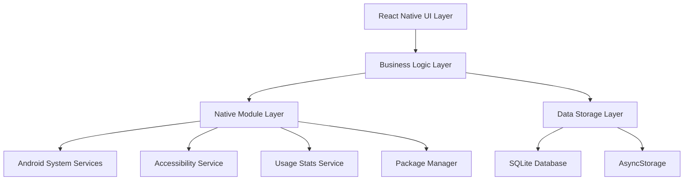

# 设计文档

## 概述

专注应用启动器是一个React Native Android应用，通过拦截用户启动特定应用的行为，要求用户输入使用目的，从而帮助用户保持专注并减少无意识的应用使用。应用采用模块化架构，支持从简单到高级的用户体验。

## 架构

### 整体架构



### 技术栈
- **前端框架**: React Native 0.72+
- **状态管理**: React Context + useReducer
- **本地存储**: SQLite (react-native-sqlite-storage) + AsyncStorage
- **原生模块**: Java/Kotlin for Android
- **UI组件**: React Native Elements + 自定义组件
- **导航**: React Navigation 6

## 组件和接口

### React Native组件层

#### 1. 主要屏幕组件
```typescript
// 主界面
interface HomeScreenProps {
  monitoredApps: MonitoredApp[];
  recentPurposes: PurposeRecord[];
}

// 应用配置界面
interface AppConfigScreenProps {
  installedApps: InstalledApp[];
  monitoredApps: MonitoredApp[];
  onToggleApp: (packageName: string) => void;
}

// 目的输入界面（覆盖层）
interface PurposeInputOverlayProps {
  targetApp: AppInfo;
  onSubmit: (purpose: string) => void;
  onCancel: () => void;
}

// 历史记录界面
interface HistoryScreenProps {
  records: PurposeRecord[];
  onSearch: (query: string) => void;
  onDelete: (recordId: string) => void;
}
```

#### 2. 核心业务组件
```typescript
// 应用监控管理器
interface AppMonitorManager {
  startMonitoring(): Promise<boolean>;
  stopMonitoring(): void;
  isMonitoring(): boolean;
  checkPermissions(): Promise<PermissionStatus>;
}

// 目的记录管理器
interface PurposeRecordManager {
  savePurpose(appPackage: string, purpose: string): Promise<void>;
  getHistory(filter?: HistoryFilter): Promise<PurposeRecord[]>;
  deleteRecord(recordId: string): Promise<void>;
  clearAllRecords(): Promise<void>;
}
```

### 原生模块接口

#### 1. 应用拦截服务 (AccessibilityService)
```java
public class AppInterceptorService extends AccessibilityService {
    // 监听应用启动事件
    public void onAccessibilityEvent(AccessibilityEvent event);
    
    // 检查是否为监控的应用
    private boolean isMonitoredApp(String packageName);
    
    // 显示目的输入界面
    private void showPurposeInput(String packageName);
    
    // 阻止应用启动
    private void blockAppLaunch();
}
```

#### 2. React Native桥接模块
```typescript
interface NativeAppInterceptor {
  // 权限管理
  requestAccessibilityPermission(): Promise<boolean>;
  checkAccessibilityPermission(): Promise<boolean>;
  
  // 监控控制
  startInterception(): Promise<boolean>;
  stopInterception(): void;
  
  // 应用信息
  getInstalledApps(): Promise<InstalledApp[]>;
  
  // 配置管理
  setMonitoredApps(packageNames: string[]): Promise<void>;
  getMonitoredApps(): Promise<string[]>;
}
```

## 数据模型

### 核心数据结构

```typescript
// 已安装应用信息
interface InstalledApp {
  packageName: string;
  appName: string;
  icon: string; // base64 encoded
  isSystemApp: boolean;
}

// 监控应用配置
interface MonitoredApp {
  packageName: string;
  appName: string;
  icon: string;
  isEnabled: boolean;
  customPrompt?: string;
  skipConditions?: SkipCondition[];
}

// 使用目的记录
interface PurposeRecord {
  id: string;
  packageName: string;
  appName: string;
  purpose: string;
  timestamp: number;
  duration?: number; // 实际使用时长（可选功能）
}

// 跳过条件（高级功能）
interface SkipCondition {
  type: 'time' | 'frequency' | 'location';
  parameters: Record<string, any>;
  isEnabled: boolean;
}

// 应用配置
interface AppConfig {
  isFirstLaunch: boolean;
  advancedMode: boolean;
  defaultPromptText: string;
  autoLaunchDelay: number; // 秒
  enableUsageTracking: boolean;
}
```

### 数据库架构

```sql
-- 监控应用表
CREATE TABLE monitored_apps (
  package_name TEXT PRIMARY KEY,
  app_name TEXT NOT NULL,
  icon_data TEXT,
  is_enabled INTEGER DEFAULT 1,
  custom_prompt TEXT,
  created_at INTEGER,
  updated_at INTEGER
);

-- 目的记录表
CREATE TABLE purpose_records (
  id TEXT PRIMARY KEY,
  package_name TEXT NOT NULL,
  app_name TEXT NOT NULL,
  purpose TEXT NOT NULL,
  timestamp INTEGER NOT NULL,
  duration INTEGER,
  FOREIGN KEY (package_name) REFERENCES monitored_apps(package_name)
);

-- 应用配置表
CREATE TABLE app_config (
  key TEXT PRIMARY KEY,
  value TEXT NOT NULL,
  updated_at INTEGER
);

-- 跳过条件表（高级功能）
CREATE TABLE skip_conditions (
  id TEXT PRIMARY KEY,
  package_name TEXT NOT NULL,
  condition_type TEXT NOT NULL,
  parameters TEXT, -- JSON格式
  is_enabled INTEGER DEFAULT 1,
  FOREIGN KEY (package_name) REFERENCES monitored_apps(package_name)
);
```

## 错误处理

### 权限错误处理
```typescript
enum PermissionError {
  ACCESSIBILITY_DENIED = 'accessibility_denied',
  USAGE_STATS_DENIED = 'usage_stats_denied',
  OVERLAY_DENIED = 'overlay_denied'
}

interface ErrorHandler {
  handlePermissionError(error: PermissionError): void;
  showPermissionGuide(permission: string): void;
  retryPermissionRequest(): Promise<boolean>;
}
```

### 应用拦截错误处理
- **服务未运行**: 自动重启AccessibilityService，显示用户指导
- **权限丢失**: 检测权限状态，引导用户重新授权
- **系统兼容性**: 检测Android版本，提供降级方案
- **应用崩溃**: 实现崩溃恢复机制，保护用户数据

### 数据错误处理
- **数据库损坏**: 实现数据库修复和重建机制
- **存储空间不足**: 提供数据清理选项
- **数据迁移失败**: 保留备份，支持回滚

## 测试策略

### 单元测试
```typescript
// 业务逻辑测试
describe('PurposeRecordManager', () => {
  test('should save purpose record correctly');
  test('should retrieve filtered history');
  test('should handle database errors gracefully');
});

// 组件测试
describe('PurposeInputOverlay', () => {
  test('should validate purpose input');
  test('should call onSubmit with valid purpose');
  test('should call onCancel when dismissed');
});
```

### 集成测试
- **权限流程测试**: 模拟权限授权和拒绝场景
- **应用拦截测试**: 测试不同应用的拦截效果
- **数据持久化测试**: 验证数据存储和恢复
- **性能测试**: 测试内存使用和响应时间

### 端到端测试
```typescript
// 使用Detox进行E2E测试
describe('App Launch Interception', () => {
  test('should show purpose input when launching monitored app');
  test('should block app launch without valid purpose');
  test('should allow app launch with valid purpose');
  test('should save purpose to history');
});
```

### 设备兼容性测试
- **Android版本**: 测试Android 8.0+ 的兼容性
- **设备品牌**: 测试主流厂商的系统定制
- **屏幕尺寸**: 适配不同屏幕尺寸和分辨率
- **性能等级**: 在低端和高端设备上测试性能

## 安全考虑

### 数据安全
- **本地存储**: 所有数据仅存储在设备本地
- **数据加密**: 敏感配置使用AES加密存储
- **权限最小化**: 仅请求必要的系统权限
- **数据清理**: 提供完整的数据删除功能

### 隐私保护
- **无网络通信**: 应用不进行任何网络数据传输
- **透明度**: 清晰说明数据收集和使用方式
- **用户控制**: 用户完全控制数据的保存和删除

## 性能优化

### 内存管理
- **懒加载**: 按需加载应用列表和图标
- **图片缓存**: 优化应用图标的内存使用
- **数据分页**: 历史记录采用分页加载

### 响应性能
- **异步操作**: 所有数据库操作使用异步方式
- **UI优化**: 使用FlatList优化长列表性能
- **原生优化**: 关键路径使用原生代码实现

### 电池优化
- **后台限制**: 最小化后台服务的资源使用
- **智能监控**: 根据用户习惯调整监控频率
- **休眠模式**: 在用户不活跃时降低监控强度